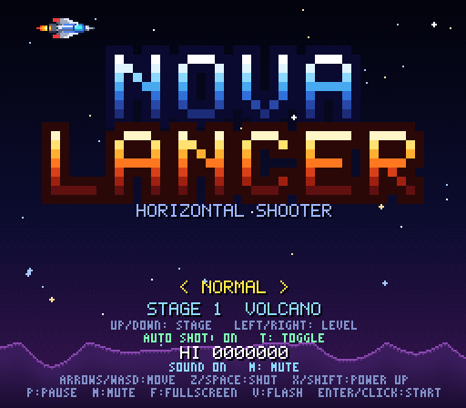
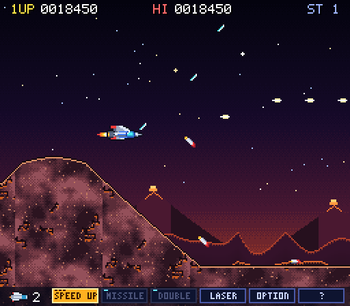
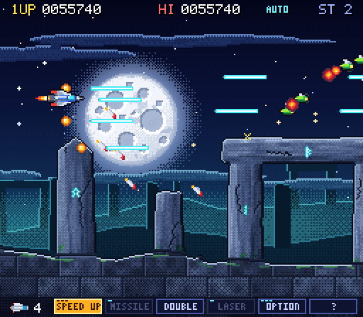
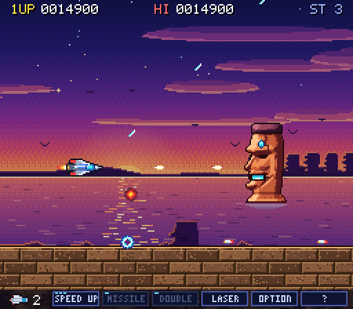
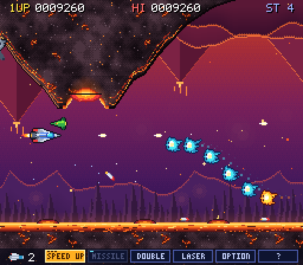
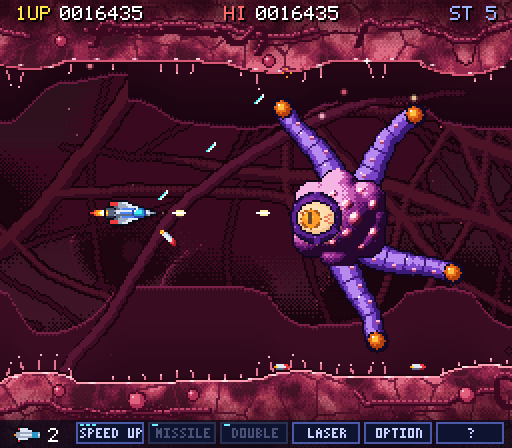
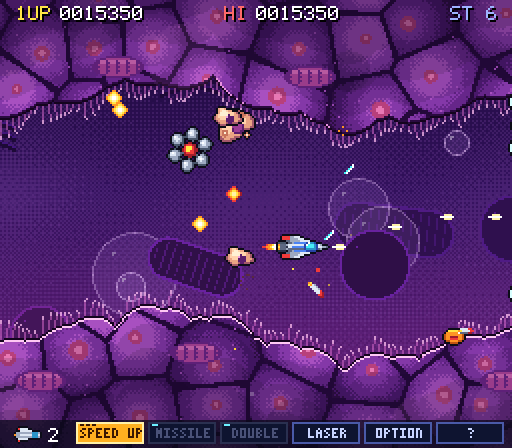
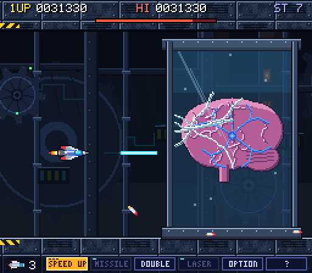

# NOVA LANCER

Gradius 스타일의 **도트 그래픽 횡스크롤 슈팅 게임**입니다. 설치·빌드 없이 브라우저에서 바로 플레이됩니다.
(순수 JavaScript + Canvas 2D, 외부 라이브러리·이미지·오디오 파일 없음 — 그래픽과 사운드는 모두 코드로 생성)

**▶ [바로 플레이하기](https://pavy23.github.io/gradius-like/)** — 설치 없이 브라우저에서 실행됩니다 (GitHub Pages, 화면을 한 번 클릭하면 소리가 켜집니다).

> 원작과 **무관한 독자 창작물**입니다. 게임 이름, 스프라이트, 효과음, BGM은 모두 이 저장소에서 새로 만들었습니다.
> 원작에서 참고한 것은 게임 *구조*(7개 스테이지 구성, 파워업 미터, 체크포인트 방식 등)뿐입니다.

| | |
| --- | --- |
|  |  |
|  |  |
|  |  |
|  |  |

## 플레이 방법

| 방법 | 설명 |
| --- | --- |
| 로컬 | `index.html`을 브라우저에서 열기 (더블클릭). 서버 불필요 |
| 로컬 서버 | `npx serve .` 또는 `python3 -m http.server` 후 `http://localhost:8000` |
| 단일 파일 | `node tools/bundle.js` → `dist/nova-lancer.html` 한 파일로 배포 가능 |
| GitHub Pages | 저장소 **Settings → Pages → Build and deployment → Source: *Deploy from a branch*** → 게임 파일이 있는 브랜치(보통 `main`) / `/ (root)` → Save. 잠시 후 `https://<계정>.github.io/gradius-like/`로 열립니다. 빌드가 필요 없어 `.nojekyll`을 넣어 Jekyll 처리를 건너뜁니다 |

권장: 최신 Chrome / Edge / Firefox / Safari (테스트는 Chromium 기준).
게임 화면을 한 번 클릭하면 키보드 입력이 활성화됩니다(iframe 안에서도 동일).

**소리가 안 나올 때**: 브라우저 정책상 소리는 *첫 클릭/키 입력 이후*에만 켜집니다. 타이틀 화면 아래쪽 줄이
`CLICK OR PRESS ANY KEY TO ENABLE SOUND`이면 아직 잠겨 있는 것이고, 클릭하면 `SOUND ON`으로 바뀝니다.
`M` 키로 음소거 상태(`SOUND OFF`)인지, 브라우저 탭이 음소거되어 있지 않은지, 기기 음량이 0이 아닌지도 확인하세요.
미리보기(iframe) 창에서 계속 무음이면 새 탭이나 로컬 `index.html`로 열어 보세요.

## 조작

| 동작 | 키보드 | 게임패드 | 터치 |
| --- | --- | --- | --- |
| 이동 | 방향키 / `WASD` | 왼쪽 스틱 / 십자키 | **화면 아무 곳이나 드래그** |
| 샷 (누르고 있으면 연사) + 미사일 | `Z` / `Space` / `J` | A · X · R1 | 오토샷(기본 ON), 끄면 `SHOT` 버튼 |
| 오토샷 켜기/끄기 | `T` | R3 (오른쪽 스틱 클릭) | `AUTO` 버튼 |
| 파워업 발동 | `X` / `Shift` / `K` | B · Y · L1 | `POWER` 버튼 |
| 일시정지 / 재개 | `P` / `Esc` | Start | `II` 버튼 / 화면 탭 |
| 타이틀로 나가기 | 일시정지 중 `Q`, 게임오버·엔딩 후 `Esc` | Select (게임오버·엔딩 후) | `QUIT` 버튼 |
| 소리 켜기/끄기 | `M` | | `SOUND` 버튼 (타이틀·일시정지) |
| 전체화면 | `F` | | |
| 번쩍임 효과 끄기 | `V` | | |
| 시작 / 계속 | `Enter` / `Space` / `Z` / 클릭 | A / Start | 화면 탭 |

타이틀 화면에서 `←` `→`로 난이도(EASY / NORMAL / HARD), `↑` `↓`로 시작 스테이지를 고릅니다(터치: 좌우/상하 **스와이프**).
창이 포커스를 잃으면 자동으로 일시정지됩니다.

**터치 조작**: 조이스틱 없이 화면(검은 여백 포함)의 어디든 손가락을 대고 끌면, 기체가 손가락이 움직인 만큼 *상대적으로* 따라옵니다.
기체가 터치한 곳으로 튀지 않고 손가락이 화면을 가리지 않습니다. 기체가 낼 수 있는 최고 속도가 상한이며 `SPEED UP`을 먹을수록 빨라집니다.
한 손가락으로 움직이는 동안 다른 손가락으로 `POWER`를 누를 수 있습니다. 버튼은 오른쪽에 있고, 타이틀/일시정지 화면의 `L<>R` 버튼으로 왼쪽에 옮길 수 있습니다(왼손잡이용, 설정은 저장됨).

## 게임 규칙

* 지형이나 적, 적 탄에 **한 번만 닿아도 파괴**됩니다. 파괴되면 **모든 파워업을 잃고 마지막 체크포인트**에서 다시 시작합니다.
* 빨간/주황색 적(캡슐 운반체)을 쓰러뜨리면 **파워 캡슐**이 나옵니다. 캡슐을 먹을 때마다 화면 아래
  파워 미터의 강조가 한 칸씩 이동하고, `POWER` 키를 누르면 강조된 항목이 발동됩니다.

  `SPEED UP` → `MISSILE` → `DOUBLE` → `LASER` → `OPTION` → `?`(실드)

  * **SPEED UP** 이동 속도 (최대 5단계) · **MISSILE** 지면을 따라 기어가는 미사일
  * **DOUBLE** 사선 위 방향 추가 샷 · **LASER** 관통 레이저 (DOUBLE과 택일)
  * **OPTION** 자기 기체를 따라다니며 같은 공격을 하는 분신 (최대 4개)
  * **?** 전방 실드 (4회 방어)
* **오토샷**: 켜 두면 샷 버튼을 누르지 않아도 샷과 미사일이 계속 발사됩니다(화면 위쪽에 `AUTO` 표시). 터치 기기에서는 기본 ON,
  키보드/게임패드에서는 기본 OFF이며, 직접 바꾼 설정은 브라우저(localStorage)에 저장됩니다.
* 강해질수록 적의 공격이 조금씩 거세집니다(랭크 시스템). 체크포인트 직후와 보스 직전에는 캡슐 운반체를 충분히 배치해 파워업을 다시 모을 수 있게 했습니다.
* 각 스테이지에는 중간보스와 보스가 있고, 보스전에서는 화면 위에 체력 게이지가 표시됩니다.
* 점수 20,000점에서 1UP, 이후 50,000점마다 1UP. 최고 점수는 브라우저(localStorage)에 저장됩니다.
* 게임 오버 후 `Enter`로 **컨티뉴**(해당 스테이지 마지막 체크포인트부터)할 수 있습니다.
* 7면을 클리어하면 엔딩 후 **난이도가 오른 2주차**가 시작됩니다.

## 스테이지 구성

원작 아케이드 슈팅의 7개 스테이지 진행(화산 → 스톤헨지 → 모아이 → 역화산 → 촉수 → 세포 → 요새)을 따르되,
지형·적·보스·음악은 모두 새로 만들었습니다. 각 스테이지는 보스 등장까지 약 95~105초이고, 전체 플레이는 대략 15~25분입니다.

| # | 이름 | 내용 | 중간보스 | 보스 |
| --- | --- | --- | --- | --- |
| 1 | VOLCANO | 우주 공역 → 구릉 → 분화구에서 용암 바위가 솟는 화산 지대 → 협곡 | 거대 화산의 분화구 | **Magma Wyrm** (용암 뱀) |
| 2 | STONEHENGE | 달밤의 거석 유적, 석문 아래를 지나는 구간, 몰려오는 드론 무리 | Hive Queen | **Henge Warden** (공전하는 선돌 고리) |
| 3 | MOAI | 황혼의 바다와 거대 석상. 석상이 뱉는 **쏴서 없앨 수 있는 링** | Mother & Child | **Tide Colossus** (조수에 오르내리는 모아이) |
| 4 | REVERSE VOLCANO | 천장에 매달린 화산, 불타는 숲, 용암 호수의 간헐천 | Iron Maiden | **Ash Phoenix** (급강하 불새) |
| 5 | TENTACLE | 살아 있는 동굴. 잘라낼 수 있는 촉수, 포자, 눈 | Tentacle Mass | **Maw Leviathan** (물어뜯는 아가리) |
| 6 | CELL | 세포 속. 분열하며 길을 막는 세포벽, 바이러스, 갈라지는 아메바 | — | **Nucleus** (전용 보스, 4단계) |
| 7 | FORTRESS | 요새 외벽 → 격납고 → 레이저 게이트와 피스톤 | Electronic Cage | **거대한 뇌** (전용 최종 보스, 3단계) |

### 보스

모든 스테이지가 서로 다른 보스를 가집니다. 움직임, 약점, 플레이어가 해야 할 일이 보스마다 다르고, 그래픽은 전부 코드로 그린 원본입니다.
보스전에는 체력 게이지가 표시되고, 페이즈가 바뀌는 지점에는 공격이 통하지 않는 연출 구간이 있어 화력으로 건너뛸 수 없습니다.
큰 공격에는 예고(선, 빛, 표시)가 붙습니다.

| 보스 | 움직임 | 약점 | 플레이어가 할 일 |
| --- | --- | --- | --- |
| **Magma Wyrm** (1면) | 머리가 8자를 그리며 화면을 누비고, 현무암 마디로 된 몸통이 따라옵니다 | 머리뿐입니다. 몸통은 총알을 막고 닿으면 죽습니다 | 몸통을 피해 머리를 조준합니다. 후반에는 돌진 차선(주황 띠와 화살표)에서 벗어나야 합니다 |
| **Henge Warden** (2면) | 선돌 6개가 크리스탈 코어 둘레를 공전합니다 | 크리스탈입니다. 돌 사이 틈이 열리면 하얗게 빛납니다 | 틈으로 사격하고, 룬 볼트와 펄스 링을 피하고, 돌이 내리꽂히는 차선(점선 띠)에서 벗어납니다 |
| **Tide Colossus** (3면) | 파도 속에서 오르내리는 거대 모아이입니다 | 목구멍의 황금 석재입니다. 입이 물 밖에 있을 때만 드러납니다 | 조수를 읽고 사격하며, 눈 광선(예고 쐐기)·파도·낙석을 피하고 쏠 수 있는 링을 처리합니다 |
| **Ash Phoenix** (4면) | 오른쪽에 머물다 예고선을 따라 급강하하고, 화면 밖으로 나갔다가 표시된 가장자리로 돌아옵니다 | 가슴 보석입니다. 날개는 방어입니다 | 차선 예고를 읽고 비키며, 깃털 부채와 불비의 틈을 지납니다. 3페이즈에서는 날개가 타 없어집니다 |
| **Maw Leviathan** (5면) | 거대한 아가리가 침을 뱉고, 돌진해서 물어뜯습니다 | 목구멍 깊은 곳의 코어입니다. 입이 열려 있을 때만 맞습니다 | 붉은 점선보다 왼쪽에서 사격하고, 돌진 예고가 뜨면 물러나며, 혀·포자·담즙을 피합니다 |

6면(Nucleus)과 7면(거대한 뇌)도 각각 전용 보스입니다.

## 개발

```
index.html            진입점 (모든 스크립트를 순서대로 로드)
js/core.js            상수, 수학 유틸, 입력(키보드/게임패드/가상입력)
js/font.js            내장 도트 폰트 (5x7, 3x5)
js/sprites.js         팔레트, 스프라이트 정의/베이킹, Painter API
js/art.js             공용 스프라이트 (기체, 탄, 캡슐, 폭발, 범용 적)
js/terrain.js         마스크 기반 지형 (충돌 + 외곽선/텍스처 스킨)
js/background.js      패럴랙스 배경 레이어
js/audio.js           WebAudio 효과음 31종 (Sound)
js/music.js           칩튠 시퀀서와 BGM 13곡 (Music)
js/player.js          자기 기체, 무기, 파워 미터, 옵션
js/game.js            게임 루프, 상태 머신, 스테이지 스크립트 빌더, HUD
js/enemies.js         범용 적 (보스는 각 스테이지 파일 안에 있습니다)
js/stages/stageN.js   스테이지별 지형·배경·적·보스 (각 파일은 독립적)
js/touch.js           터치 컨트롤(드래그 이동, 버튼, 스와이프),  js/debug.js  개발 도구(G.lint 등)
tools/                번들러, 헤드리스 스모크 테스트, 보스 벤치마크/스크린샷, 테스트용 봇
docs/STAGE_AUTHORING.md   스테이지 제작 가이드 (엔진 API, 밸런스 기준)
```

* 고정 60Hz 시뮬레이션, 논리 해상도 256×224 (정수 배율 스케일). 프레임당 시뮬레이션 비용은 평균 0.1ms 미만입니다(헤드리스 Chromium 측정).
* URL 파라미터: `?stage=N`(N면부터 시작) `&diff=easy|normal|hard` `&god=1`(무적) `&debug=1`(카운터 표시)
  `&auto=1|0`(오토샷을 이번 접속에만 강제) `&touch=1`(데스크톱에서도 터치 UI 표시) `&sens=1.3`(터치 드래그 감도, 0.5~3).
* 스테이지 설계 점검: 브라우저 콘솔에서 `G.lint(0)` (지형 폭, 체크포인트 안전, 캡슐 간격 등을 자동 검사).
* 헤드리스 회귀 테스트(Playwright 필요): `node tools/smoke-test.js`
  * 전 스테이지 린트 → 무적 봇 완주(흐름 검증, 실패 시 오류) → 회피 봇 완주(난이도 리포트)
  * `--strict`(회피 봇도 클리어해야 통과), `--from 5`(5면부터), `--lint`(린트만)
* 보스전 측정: `node tools/bossbench.js <면> --power none|mid|full [--runs 3] [--diff hard] [--loop 1] [--trace]`
  (체크포인트에서 시작해 봇이 보스를 잡는 데 걸린 시간·사망 원인), `node tools/bossshots.js <면> --out sheet.png`
  (전투 장면을 시간 캡션과 함께 한 장으로 모은 컨택트 시트)
* 새 스테이지는 `js/stages/`에 파일을 추가하고 `index.html`에 스크립트 태그를 넣으면 됩니다.

## 참고 / 고지

* 스테이지 구성(7면 진행, 1~5면은 중간보스 후 같은 계열의 보스, 6·7면은 전용 보스)과 파워 미터 구조(SPEED UP·MISSILE·DOUBLE·LASER·OPTION·?),
  사망 시 체크포인트 부활과 파워업 상실은 원작 아케이드판(1985)에 대한 공개 자료를 웹 검색으로 대조해 참고했습니다.
  (검색 결과 요약을 여러 출처에서 교차 확인했으며, Wikipedia 등 원문 페이지는 접근이 차단되어 직접 열람하지 못했습니다.)
* 터치 조작(드래그 이동, 오토샷, 버튼, 스와이프)은 Chromium의 모바일 에뮬레이션(터치 이벤트 주입)으로만 검증했고,
  실제 iOS/Android 기기에서 손으로 써 본 것은 아닙니다. 감도와 버튼 위치는 실기기에서 조정이 필요할 수 있습니다.
* 난이도(보스 5종 포함)는 자동 플레이 봇으로만 검증했고 사람이 직접 플레이 테스트한 것은 아닙니다. 봇은 예고선을 읽지 못해서 일부 보스 패턴(급강하, 돌진, 내리꽂기)에서는 사람보다 자주 죽습니다. 사운드도 직접 들어 보고 튜닝한 것이 아니라
  이론과 분석(음높이·타이밍·클리핑 측정)으로 검증했습니다. 밸런스나 음악에 대한 의견은 이슈로 남겨 주세요.
* 모든 코드/그래픽/사운드는 이 프로젝트를 위해 새로 작성되었으며 외부 에셋을 사용하지 않습니다.
